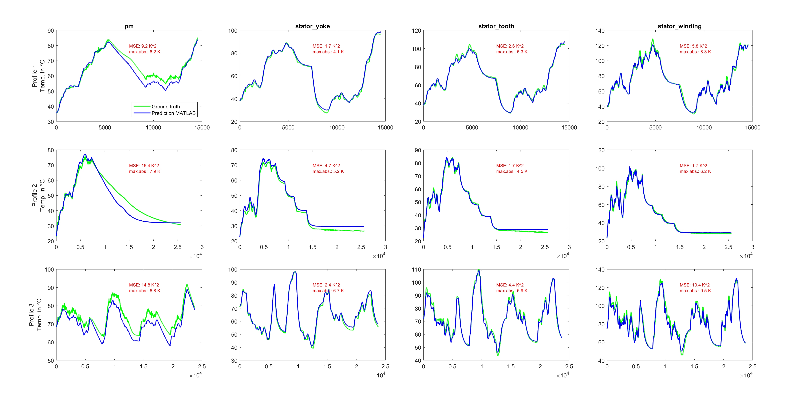

# Thermal neural network for electric motor temperature estimation
This is a MATLAB&reg; implementation of the thermal neural network as introduced by Kirchgässner et al. [1].
The code is the result of a collaboration with [Schaeffler Technologies AG & Co. KG](https://www.schaeffler.com/en/). The underlying application is a virtual sensor for estimating the temperature within an electric motor based on other available sensor data.
The code in this repo requires that the data file [2] (measures_v2.csv) has previously been downloaded into a folder data/input relative to the project root. During the project startup, the location of the data file is checked, and if not present, you have the option to download the data automatically from the MathWorks Supportfiles.

### MathWorks Products (https://www.mathworks.com)

MATLAB version R2025a is **strongly recommended** for full functionality. At a minimum,  requires MATLAB release R2024a or newer as well as [Deep Learning Toolbox](https://www.mathworks.com/products/deep-learning.html).
For export to Simulink, MATLAB release R2024b or newer is required.

## Getting Started 
Open the TNN.prj file and run the TNN_matlab.m in the src folder. Note that this comes in two variants controlled by the optimizedMode = true/false variable.
- optimizedMode = true: default, run an optimized implementation which is faster, but requires authoring the backward pass
- optimizedMode = false: run with auto-diff for computing the backward, easier to extend, but slower: The first epoch may take several minutes to complete.

## Simulink Usage
Optionally, after training the model, you can export it to Simulink. The TNN architecture is implemented in TNN_model.slx and the script
will export two additional model files, ploss_net.slx and cond_net.slx, containing the network for the power loss and conductance part, respectively.
The exported Simulink models also support C/C++ code generation.

## References
[1] Wilhelm Kirchgässner and Oliver Wallscheid and Joachim Böcker,
Thermal neural networks: Lumped-parameter thermal modeling with state-space machine learning,
Engineering Applications of Artificial Intelligence,
Volume 117, Part A,
2023

[2] Wilhelm Kirchgässner and Oliver Wallscheid and Joachim Böcker,
Electric Motor temperature, [Kaggle](https://www.kaggle.com/dsv/2161054)
2021

## Contact
Christoph Stockhammer (cstockha@mathworks.com)  
Georg Göppert, Concepts R&D E-Mobility (georg.goeppert@schaeffler.com)  
Tobias Moroder, Innovation Cluster Digital Solutions (morodtbi@schaeffler.com)      
Marcel Adrian, Concepts R&D E-Mobility (adriamrc@schaeffler.com)  
Jonas Fuchs, Innovation Cluster Digital Solutions (Jonas.Fuchs@schaeffler.com)   

## License
The license is available in the license.txt file in this GitHub repository.
Copyright 2025 The MathWorks, Inc.